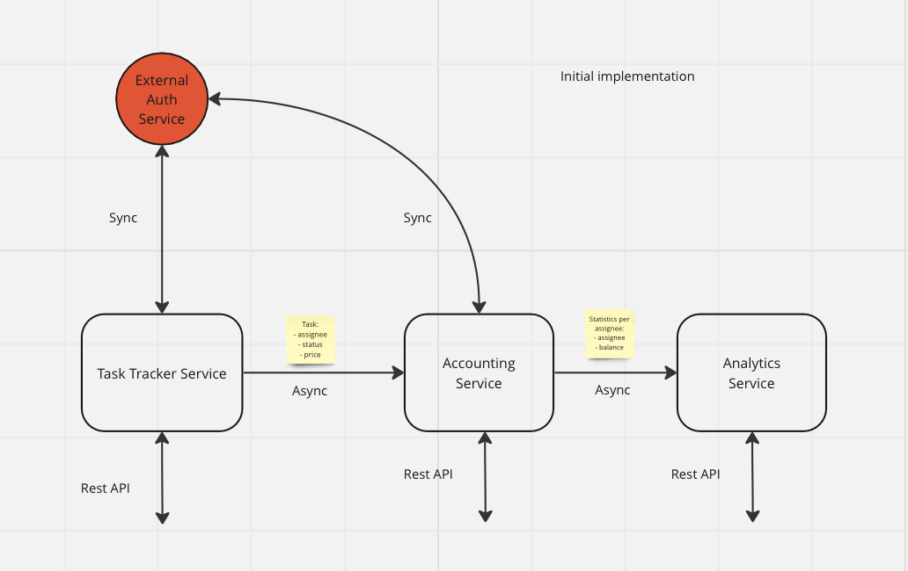

# Homework 0

[Miro link](https://miro.com/app/board/uXjVNskQnu0=/)

## Архитектура:
### 3 Сервиса:

**Task Tracker Service** -- жизненный цикл тасок, там же происходит ассайн задач, также предоставляет REST API для работы с тасками\
**Accounting Service** -- подсчет заработка каждого попугая и его баланса\
**Analytics Service** -- подсчет статистики и заработка на уровне компании, REST API для работы c полученной статистикой

Task Tracker Service и Accounting Service для обеспечения auth механизмов синхронно общаются с внешним сервисом аутентификации UberPopug Inc.

Коммуникации между TaskTrackerService и AccountingService асинхронные, Accounting Service получает обновления о статусе задач и на основе этих данных считает статистику
Коммуникации между AccountingService и AnalyticsService также асинхронные, Analytics Service получает обновления статы в разрезе каждого воркера и на основе этих данных строит статистику на основе компании

### Аргументация
Подобная архитектура обладает следующими положительными качествами
Отказоустойчивость сервисов различных типов  можно обеспечить горизонтальным масштабированием
При полной неработоспособности сервисов одного типа, несвязанная бизнес логика продолжит работать
Сервисы зависят друг от друга только через модель данных, передаваемых асинхронно, это решается созданием schema registry

