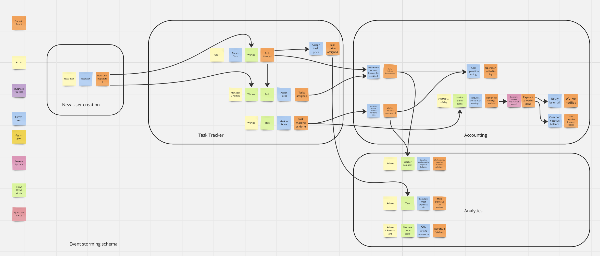

# Homework 1

## (Задание 1) Разобрать каждое требование на составляющие (актор, команда, событие, query). Определить, как все бизнес цепочки будут выглядеть и на какие шаги они будут разбиваться.

Для ответа на данный вопрос я построил Event Storming схему

[Event Storming Miro Link](https://miro.com/app/board/uXjVNskQnu0=/?moveToWidget=3458764580166384869&cot=10)

## (Задание 2) Построить модель данных для системы и модель доменов.

[Data Model Miro Link](https://miro.com/app/board/uXjVNskQnu0=/?moveToWidget=3458764580166640285&cot=10)

## (Задания 3, 4) Определить, какие общие данные нужны для разных доменов и как связаны данные между разными доменами. Разобраться, какие сервисы, кроме тудушника, будут в нашей системе и какие между ними могут быть связи (как синхронные, так и асинхронные).

[Domain Data and Service Miro Link](https://miro.com/app/board/uXjVNskQnu0=/?moveToWidget=3458764580166640790&cot=10)

## (Задание 5)

[Business Events Miro Link](https://miro.com/app/board/uXjVNskQnu0=/?moveToWidget=3458764579895058113&cot=14)

## (Задание 6)

[CUD Events Miro Link](https://miro.com/app/board/uXjVNskQnu0=/?moveToWidget=3458764580166236537&cot=14)

